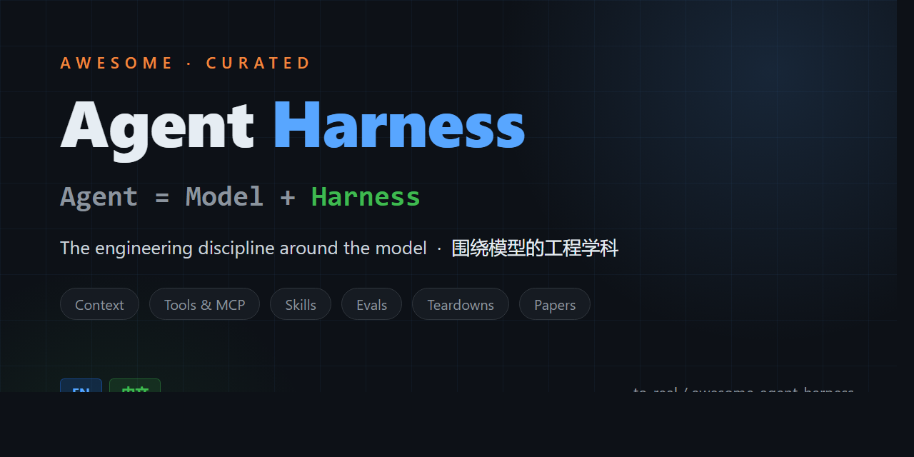

# Awesome Agent Harness

  

  <em>双语（EN / 中文）维护的 Agent Harness Engineering 精选资源库—— 上下文工程、工具设计、技能、记忆、编排、评估，与主流编程 Agent 拆解。</em>

  
  
  
  
  
  
  
  

  <strong>200 条带注释资源</strong> · 14 个板块 · 中英双语 · 链接复检于 <strong>2026-08-16</strong> · <a href="docs/quality-audit-2026-06-25.md">质量审计记录</a>

---

**English Version → [README.md](README.md)**

模型已不再是难点，围绕模型构建的系统才是。

2026 年 2 月，Mitchell Hashimoto 为从业者们一直在做的事情给出了名字：**Harness Engineering（驾具工程）**——设计包裹 AI Agent 的完整环境，决定其成败的工程学科。几周内，OpenAI 和 Anthropic 发布工程报告加以扩展。这个术语之所以成立，是因为它命名了一个真实的缺口：Prompt Engineering 优化单轮交互；Context Engineering 管理模型看到的内容；Harness Engineering 治理跨越每个会话的整个执行环境。

本列表聚焦 **Harness**，而非模型。目标读者是 **AI PM 和 Agent 产品工程师**——注释先讲决策和模式（该不该用、代价是什么、什么时候会坏），再讲细节。这个领域的大多数列表只是链接堆砌——同样的二十个书签，没有判断，也没有维护。本列表按"作品级"标准策展：

- **每个条目都在为自己辩护**：是什么*以及为什么值得收录*，有量化结论的地方直接给数字（基准分差、失败模式、团队规模）。
- **每条链接都经过验证**：每次刷新全量复检；方法与每一次修复都记录在[审计日志](docs/quality-audit-2026-06-25.md)里，刷新间隙由定时 [CI 任务](.github/workflows/link-check.yml)值守。
- **双语同步维护**：中文版与英文版并行更新，注释为中文读者改写，不是机翻。
- **为人读而设计**：每节有**必读**、开头有 10 条入门集、交叉引用代替重复堆砌。

标记：🆕 = 2025–2026 年发布/更新 · ⚠️ = 注意事项 · **(必读)** = 本节核心。欢迎贡献——见 [CONTRIBUTING](CONTRIBUTING.md)。

**最近刷新 2026-08-16** —— 本次新增：自进化 Harness 研究浪潮、Harness Profiles、Claude Code Agent Teams，以及最早两篇 harness-engineering 综述。

---

## 目录

- [⭐ 必读入门集](#-必读入门集)
- [1 · 什么是 Harness？（定义与边界）](#1--什么是-harness定义与边界)
- [2 · 上下文工程（Context Engineering）](#2--上下文工程context-engineering)
- [3 · 工具设计与 MCP](#3--工具设计与-mcp)
- [4 · Agent 循环与验证](#4--agent-循环与验证)
- [5 · 架构模式](#5--架构模式)
- [6 · 技能与渐进披露](#6--技能与渐进披露)
- [7 · 记忆与状态管理](#7--记忆与状态管理)
- [8 · 权限、安全与沙箱](#8--权限安全与沙箱)
- [9 · Harness ↔ 评估交互](#9--harness--评估交互)
- [10 · 编程 Agent Harness 拆解](#10--编程-agent-harness-拆解)
- [11 · 多 Agent 编排](#11--多-agent-编排)
- [12 · 框架与工具](#12--框架与工具)
- [13 · 演讲、播客与幻灯片](#13--演讲播客与幻灯片)
- [14 · 学术论文](#14--学术论文)
- [相关列表](#相关列表)
- [贡献指南](#贡献指南)
- [许可证](#许可证)

---

## ⭐ 必读入门集

*先读这些。它们共同构成了 Harness Engineering 的完整认知地图。*

1. **[My AI Adoption Journey](https://mitchellh.com/writing/my-ai-adoption-journey)** — Mitchell Hashimoto — *博客, 2026.02* — 起源帖。"每次发现 Agent 犯错，就花时间工程化一个解决方案，让它再也不会犯同样的错。" 创造了 "Harness Engineering" 并给出了基础公式：**Agent = Model + Harness**。

2. **[Harness Engineering: Leveraging Codex in an Agent-First World](https://openai.com/index/harness-engineering/)** — OpenAI (Ryan Lopopolo) — *博客, 2026.02* — 旗舰实战报告。3 人团队在 5 个月内用零人工代码构建了百万行产品。核心经验：仓库即知识系统、渐进披露优于单一 AGENTS.md、机械化执行优于文档、持续熵管理。🆕

3. **[Building Effective Agents](https://www.anthropic.com/research/building-effective-agents)** — Anthropic — *博客, 2024.12* — 基础架构指南：何时用 workflow vs. agent，如何组合原语（提示链、路由、编排器-工作者、评估器-优化器）。从简单开始。

4. **[Effective Context Engineering for AI Agents](https://www.anthropic.com/engineering/effective-context-engineering-for-ai-agents)** — Anthropic — *博客, 2025.09* — 上下文工程的经典必读文本。它把 Harness 的核心工作说清楚：编辑、压缩、记忆、编程式工具调用，以及“什么样的上下文配置最可能产生期望行为？” **(必读)**

5. **[Harness Design for Long-Running Application Development](https://www.anthropic.com/engineering/harness-design-long-running-apps)** — Anthropic (Prithvi Rajasekaran) — *博客, 2026.03* — 三 Agent Harness（规划器→生成器→评估器）用于持续多会话开发。关键洞察：Harness 的每个组件都编码了一个关于"模型做不到什么"的假设，而这些假设会随模型进步而过期。🆕

6. **[Harness Engineering](https://martinfowler.com/articles/exploring-gen-ai/harness-engineering.html)** — Martin Fowler / Birgitta Böckeler — *博客, 2026* — 最清晰的概念图谱：三个互锁系统——上下文工程、架构约束、熵管理。"Humans on the loop"——设计环境而非检查单个输出。🆕

7. **[The Anatomy of an Agent Harness](https://blog.langchain.com/the-anatomy-of-an-agent-harness/)** — LangChain — *博客, 2026.03* — 五个原语：文件系统（持久状态）、代码执行、沙箱（隔离+验证）、记忆（跨会话持久化）、上下文管理（对抗"上下文腐烂"的压缩）。🆕

8. **[Improving Deep Agents with Harness Engineering](https://blog.langchain.com/improving-deep-agents-with-harness-engineering/)** — LangChain (Vivek Trivedy) — *博客, 2026.02* — 实验证明：仅改变 Harness（自验证、追踪、中间件钩子）就让 Agent 从 Terminal Bench 2.0 的 Top 30 跃升至 Top 5。模型不变，提升 13.7 分。🆕

9. **[Writing Effective Tools for Agents — with Agents](https://www.anthropic.com/engineering/writing-tools-for-agents)** — Anthropic (Ken Aizawa) — *博客* — 工具设计就是 Agent UX。"Agent 的能力天花板取决于我们给它的工具。" 工具命名、Schema、错误表面。

10. **[Agents Are Models Using Tools in a Loop](https://simonwillison.net/2025/May/22/tools-in-a-loop/)** — Simon Willison — *博客, 2025.05* — 公认的 Agent 定义："技巧在于工具和循环的设计。" 最简洁地说明了为什么 Harness 而非模型决定了行为。

---

## 1 · 什么是 Harness？（定义与边界）

*模型 / Harness / 技能的分解。Prompt Engineering 在哪里结束，Harness Engineering 从哪里开始。*

- **[My AI Adoption Journey](https://mitchellh.com/writing/my-ai-adoption-journey)** — Mitchell Hashimoto — *博客, 2026.02* — "Harness Engineering"的起源。从聊天机器人怀疑者→Claude Code 用户→Harness 工程师的完整旅程。Ghostty 的 AGENTS.md 是增量规则积累的典型范例。

- **[Harness Engineering: Leveraging Codex in an Agent-First World](https://openai.com/index/harness-engineering/)** — OpenAI — *博客, 2026.02* — 前沿实验室定义：Harness 是"让 Agent 进行可靠工作的脚手架、工具、反馈循环和约束的全部环境"。也见「必读入门集」。

- **[Harness Engineering](https://martinfowler.com/articles/exploring-gen-ai/harness-engineering.html)** — Martin Fowler — *博客, 2026* — 三个系统：上下文工程、架构约束（确定性 linter/测试）、熵管理（修复 Agent）。

- **[Hidden Technical Debt: Agent Harness](https://leehanchung.github.io/blogs/2026/05/08/hidden-technical-debt-agent-harness/)** — Han-Chung Lee — *博客, 2026.05* — "Harness 就是 Agent；团队所谓的'模型'主要是 Harness + 产品。" 🆕

- **[The Model Is the Product](https://leehanchung.github.io/talks/2025/04/23/the-model-is-the-product/)** vs. **[The Model Is Not the Product](https://www.youtube.com/watch?v=EEw2PpL-_NM)** — Han-Chung Lee vs. Hamel Husain — *演讲, 2025* — Harness/模型辩论的两面。

- **[Agents Are Models Using Tools in a Loop](https://simonwillison.net/2025/May/22/tools-in-a-loop/)** — Simon Willison — *博客, 2025.05* — 如果 Agent 的定义是"模型+工具+循环"，那么模型之外的一切——工具和循环——就是 Harness。

- **[Trustworthy Agents in Practice](https://www.anthropic.com/research/trustworthy-agents)** — Anthropic — *研究, 2026* — 将 Agent 定义为能指挥自身流程和工具使用的模型，并说明可信 Harness 为什么需要评估、监控和控制。🆕

- **[Harness Engineering for Language Agents: CAR Decomposition](https://www.preprints.org/manuscript/202603.1756)** — 匿名作者 — *预印本, 2026.04* — 首篇将 Harness Engineering 作为研究对象的学术论文。提出 CAR 分解（Control, Agency, Runtime）和 HarnessCard 报告工件。🆕

- **[Natural-Language Agent Harnesses](https://arxiv.org/html/2603.25723v1)** — Pan 等 — *论文, 2026.03* — 将 AGENTS.md、Agent Skills 和技能包视作可迁移的自然语言 Harness 设计模式。🆕

- **[The Harness Model — AI Engineering Maturity Matrix](https://handsonarchitects.com/blog/2026/the-harness-model-ai-engineering-maturity-matrix/)** — Laskowski & Michalak (HandsOn Architects) — *博客, 2026.04* — 10 维度成熟度矩阵，从"偶尔使用 AI"到"Agent 优先交付"。团队自评工具。🆕

- **[Agent Harness Engineering](https://www.oreilly.com/radar/agent-harness-engineering/)** — Addy Osmani (O'Reilly Radar) — *博客* — "一个平庸模型+优秀 Harness 击败优秀模型+糟糕 Harness。" 🆕

**必读：** Hashimoto · OpenAI (Codex) · Fowler · Lee (harness)

---

## 2 · 上下文工程（Context Engineering）

*填充上下文窗口的艺术与科学：放什么进去、裁剪什么、如何结构化。*

- **[Effective Context Engineering for AI Agents](https://www.anthropic.com/engineering/effective-context-engineering-for-ai-agents)** — Anthropic — *博客, 2025.09* — 上下文工程的经典必读文本。上下文 = "采样时包含的 token 集合"。涵盖系统提示、工具、示例、消息历史、即时策略、压缩、记忆和编程式工具调用。也见「必读入门集」。**(必读)**

- **[Context Engineering for AI Agents: Lessons from Building Manus](https://manus.im/blog/Context-Engineering-for-AI-Agents-Lessons-from-Building-Manus)** — Manus — *博客, 2025* — Manus 的生产级上下文工程经验：工具爆炸、动作约束、文件系统记忆、KV-cache 压力和 Agent 状态稳定性。官方提供[中文版](https://manus.im/zh-cn/blog/Context-Engineering-for-AI-Agents-Lessons-from-Building-Manus)。

- **[Context Engineering in Manus](https://rlancemartin.github.io/2025/10/15/manus/)** — Lance Martin (LangChain) — *博客, 2025.10* — 对 Manus 上下文策略最锋利的拆解：全量/压缩双版本工具结果保 KV-cache 稳定、子 Agent 本质是上下文隔离、不到 20 个原子工具把状态卸载到沙箱。结尾是 Harness 的"苦涩教训"：如果换更强的模型也没用，瓶颈就是你的 Harness。

- **[How Long Contexts Fail and How to Fix Them](https://www.dbreunig.com/2025/06/22/how-contexts-fail-and-how-to-fix-them.html)** — Drew Breunig — *博客, 2025.06* — 长上下文的典型失败模式和工程修复方法。

- **[Context Management for Deep Agents](https://www.langchain.com/blog/context-management-for-deepagents)** — LangChain — *博客, 2026.01* — 长时运行 Agent 会话中的上下文管理实践模式。🆕

- **[From Context Engineering to Context Infrastructure](https://tacnode.io/post/from-context-engineering-to-context-infrastructure)** — Tacnode — *博客, 2026.03* — 技术已经明确，但基础设施（实时数据管道、一致性快照）仍缺失。🆕

- **[Agentic Context Engineering: Evolving Contexts for Self-Improving Language Models](https://openreview.net/forum?id=qQ5MZ5Mx7p)** — Zhang 等 (ICLR 2026) — *论文* — 让模型演化自己的上下文管理策略。🆕

- **[Dive into Claude Code: The Design Space of Today's and Future AI Agent Systems](https://arxiv.org/abs/2604.14228)** — Liu 等 — *论文, 2026* — 反向拆解 Claude Code 的 Harness：权限模式、压缩、MCP/插件/技能/hooks、子 Agent 和会话存储。🆕

- **[COMPASS: Enhancing Agent Long-Horizon Reasoning with Evolving Context](https://arxiv.org/abs/2510.08790)** — Wan 等 — *论文* — 面向长时任务的演化式上下文策略。

- **[LOCA-bench](https://arxiv.org/pdf/2602.07962)** — Zeng 等 — *论文, 2026* — 在受控条件下评估各种上下文工程策略（上下文编辑、上下文感知、记忆工具、编程式工具调用）。🆕

- **[AgentSwing: Adaptive Parallel Context Management](https://arxiv.org/abs/2603.27490)** — Feng 等 — *论文, 2026* — 面向长时 Web Agent 的并行上下文管理路由。🆕

- **[Autonomous Context Compression](https://www.langchain.com/blog/autonomous-context-compression)** — LangChain — *博客, 2026* — 压缩不再靠固定 token 阈值或 `/compact` 命令：模型自己挑时机（任务边界、加载大块上下文之前）触发摘要。已进入 Deep Agents SDK/CLI。🆕

**必读：** Anthropic（上下文工程） · Manus · Breunig

---

## 3 · 工具设计与 MCP

*工具是 Agent 的双手。MCP 是连接它们的协议。两者都是 Harness 的承重面。*

- **[Writing Effective Tools for Agents](https://www.anthropic.com/engineering/writing-tools-for-agents)** — Anthropic — *博客* — "Agent 的能力取决于工具。" 工具命名、Schema、错误表面。**(必读)**

- **[Model Context Protocol (MCP)](https://modelcontextprotocol.io/)** — Anthropic — *规范/文档* — 连接 AI 模型和外部工具/数据源的开放标准。现代 Harness 的管道层。

- **[MCP 发布候选版 — 2026 年 7 月](https://blog.modelcontextprotocol.io/posts/2026-07-28-release-candidate/)** — MCP — *规范, 2026.07* — 协议的去向：默认无状态（取消 initialize 握手）、Extensions 升为一等公民（服务端渲染 UI、Tasks）、工具 schema 升至完整 JSON Schema 2020-12、加固 OAuth/OIDC，并引入"废弃到移除至少 12 个月"的生命周期政策。产品要押注 MCP 之前先读这个。🆕

- **[MCP Tool Annotations](https://blog.modelcontextprotocol.io/posts/2026-03-16-tool-annotations/)** — MCP — *规范, 2026.03* — 标准化的工具元数据（`readOnlyHint`、破坏性标记等 OpenAPI 风格注解）——你的权限 UI 和审批弹窗应该挂在钩子上。规格改动很小，产品影响很大。🆕

- **[MCP: A New Standard for AI Tool Integration](https://www.anthropic.com/news/model-context-protocol)** — Anthropic — *博客, 2024.11* — MCP 的发布与设计动机。

- **[Code Execution with MCP: Building More Efficient Agents](https://www.anthropic.com/engineering/code-execution-with-mcp)** — Anthropic — *博客, 2025.09* — 把执行逻辑放进 MCP server，让 Agent 先搜索、过滤、转换工具结果，再决定哪些内容进入上下文窗口。

- **[A Practical Guide to Building AI Agents](https://openai.com/business/guides-and-resources/a-practical-guide-to-building-ai-agents/)** — OpenAI — *博客, 2026.04* — 工具设计的多对多 Agent-工具关系和分层护栏模式。也见相关章节「必读」。🆕

- **[Gemini API Function Calling](https://ai.google.dev/gemini-api/docs/function-calling)** — Google — *文档* — Gemini 的官方工具调用接口，覆盖 schema、并行函数调用和组合式工具使用。

- **[Equipping Agents for the Real World with Agent Skills](https://www.anthropic.com/engineering/equipping-agents-for-the-real-world-with-agent-skills)** — Anthropic — *博客* — 技能作为基于工具基础的可组合、渐进披露的能力。

- **[OpenAI Agents SDK — Tools](https://openai.github.io/openai-agents-python/tools/)** — OpenAI — *文档* — Agents SDK 中工具定义、函数签名和错误处理的方式。

- **[Claude Code Hooks](https://docs.anthropic.com/en/docs/claude-code/hooks)** — Anthropic — *文档* — 生命周期钩子（PreToolUse, PostToolUse 等），让 Harness 工程师在工具执行的每个步骤注入自定义逻辑。

- **[Open Reward Standard (ORS)](https://docs.openreward.ai/)** — General Reasoning — *规范* — 在 MCP 之上加入 episode、reward、curriculum 等 RL 原语。🆕 ⚠️(早期阶段)

**必读：** Anthropic（工具设计） · MCP 规范 · OpenAI（实践指南）

---

## 4 · Agent 循环与验证

*Agent 如何迭代：核心循环、自验证、死循环检测、"Ralph Wiggum"模式。*

- **[Unrolling the Codex Agent Loop](https://openai.com/index/unrolling-the-codex-agent-loop/)** — OpenAI — *博客, 2026.01* — Codex Agent 循环详解：读取上下文→规划→执行→验证→提交（或重试）。🆕

- **[Harness Design for Long-Running Application Development](https://www.anthropic.com/engineering/harness-design-long-running-apps)** — Anthropic — *博客, 2026.03* — 生成器和评估器 Agent 之间的"Sprint 合同"。"将做工作的 Agent 与评判工作的 Agent 分开"是强有力的杠杆。也见「必读入门集」。🆕

- **[Effective Harnesses for Long-Running Agents](https://www.anthropic.com/engineering/effective-harnesses-for-long-running-agents)** — Anthropic — *博客, 2025.11* — 跨多个上下文窗口保持进度的模式：初始化 Agent→编码 Agent 交接。

- **[Ralph Wiggum as a Software Engineer](https://ghuntley.com/ralph/)** — Geoffrey Huntley — *博客* — 极简 `while :; do cat PROMPT.md | claude-code; done` Harness 模式。

- **[cwc-long-running-agents](https://github.com/anthropics/cwc-long-running-agents)** — Anthropic — *代码库* — Code with Claude 2026 的示例 Harness 原语。🆕

- **[Run Long-Horizon Tasks with Codex](https://developers.openai.com/blog/run-long-horizon-tasks-with-codex/)** — OpenAI — *博客* — 将 Plan.md、Implement.md 等里程碑文档作为 Harness 级状态。🆕

- **[Improving Deep Agents with Harness Engineering](https://blog.langchain.com/improving-deep-agents-with-harness-engineering/)** — LangChain — *博客, 2026.02* — 三个优化旋钮：系统提示、工具、中间件。构建-验证循环和死循环检测。也见「必读入门集」。🆕

- **[Introducing Dynamic Workflows in Claude Code](https://claude.com/blog/introducing-dynamic-workflows-in-claude-code)** — Anthropic — *博客, 2026.05* — 动态并行子 Agent 编排：Claude 生成 JavaScript 编排脚本，扇出到并行子 Agent 并进行对抗性验证。🆕

- **[Better Harness: A Recipe for Harness Hill-Climbing with Evals](https://www.langchain.com/blog/better-harness-a-recipe-for-harness-hill-climbing-with-evals)** — LangChain (Vivek Trivedy) — *博客, 2026.04* — “Evals 是 Agent 的训练数据”：人工整理、trace 挖掘、优化/留出集、基线、诊断-实验-验证循环和人工复查。🆕

- **[Agent QA](https://github.com/vostride/agent-qa)** — Vostride — *工具/代码库, 2026* — 用自然语言运行 Web/移动端验证循环，通过持久测试记忆、选择器自愈和失败证据支持 CLI 与 MCP 工作流。⚠️ 当前采用 FSL-1.1-ALv2，是 source-available 而非 OSI 开源。🆕

- **[How Middleware Lets You Customize Your Agent Harness](https://www.langchain.com/blog/how-middleware-lets-you-customize-your-agent-harness)** — LangChain (Sydney Runkle) — *博客, 2026.03* — 围绕模型调用和工具调用的 hooks，是 Harness 定制的主要表面。🆕

- **[How to Build a Custom Agent Harness](https://www.langchain.com/blog/how-to-build-a-custom-agent-harness)** — LangChain (Sydney Runkle) — *博客, 2026.06* — Harness = 极简核心循环 + 可组合中间件（记忆、重试、策略、人工监督、成本控制）。核心论点：最好的 Agent 来自匹配任务的 Harness，而不是万能 Harness。🆕

- **[Loop Engineering: Getting Started with Loops](https://claude.com/blog/getting-started-with-loops)** — Claude Code 团队 — *博客, 2026.06* — 把"再跑一次 Agent"变成一门工程：四种循环类型（轮次循环、目标循环 `/goal`、定时循环 `/loop` + `/schedule`、主动循环），以及各自的代码质量和 token 预算管理。🆕

- **[Production Agents Self-Heal](https://www.langchain.com/blog/production-agents-self-heal)** — LangChain — *博客, 2026* — 部署后的回归检测成为 Harness 的职责：错误按签名分桶，与 7 天基线做 Poisson 检验，triage agent 核查因果链，再由编码 Agent 提交修复 PR——全程无人值守。🆕

**必读：** OpenAI（Codex 循环） · Anthropic（长时运行） · LangChain（改进 Deep Agents）

---

## 5 · 架构模式

*Agent 的结构：单 Agent 循环、规划-执行、多 Agent 拓扑、路由、编排。*

- **[Building Effective Agents](https://www.anthropic.com/research/building-effective-agents)** — Anthropic — *博客, 2024.12* — 经典模式指南：提示链、路由、并行化、编排器-工作者、评估器-优化器。"从简单开始。" **(必读)**

- **[A Practical Guide to Building AI Agents](https://openai.com/business/guides-and-resources/a-practical-guide-to-building-ai-agents/)** — OpenAI — *博客, 2026.04* — 单 Agent vs. 多 Agent 编排。也见相关章节「必读」。🆕

- **[Plan-and-Execute Agents](https://blog.langchain.com/plan-and-execute-agents/)** — LangChain — *博客* — 将规划与执行分离为不同 Harness 层的经典写法。

- **[Agent Development Kit (ADK)](https://developers.googleblog.com/en/agent-development-kit-easy-to-build-multi-agent-applications/)** — Google — *博客, 2025* — Google 的多 Agent 拓扑、工具注册模型和评估流水线。

- **[Agents as a Service](https://sierra.ai/blog/agents-as-a-service)** — Sierra — *博客, 2026.03* — 客服 Agent 的生产 Harness：让 Ghostwriter 直接使用工作区、在沙箱里验证变更，并形成构建→测试→发布的改进循环。🆕

- **[Building Box AI: How an Enterprise Content Platform Went AI-Native with Deep Agents](https://www.langchain.com/blog/building-box-ai-how-an-enterprise-content-platform-went-ai-native-with-deep-agents)** — LangChain / Box — *案例, 2026.06* — 企业内容 Agent 的真实架构：父 Agent、动态子 Agent、中间件、引用、提示缓存和上下文总结。🆕

- **[Compound AI Systems](https://bair.berkeley.edu/blog/2024/02/18/compound-ai-systems/)** — Zaharia 等 (Berkeley) — *博客, 2024.02* — 从单一模型到模型+检索器+工具+反馈循环的系统转变。Harness Engineering 的概念先驱。

- **[Scaling Managed Agents: Decoupling the Brain from the Hands](https://www.anthropic.com/engineering/managed-agents)** — Anthropic — *博客, 2026* — 将规划的“脑”和执行的“手”分离，并让二者独立扩展。🆕

- **[The "Think" Tool: Enabling Claude to Stop and Think](https://www.anthropic.com/engineering/claude-think-tool)** — Anthropic — *博客* — 把显式“思考空间”作为 Harness 级能力提供给 Agent。

- **[How Squad Runs Coordinated AI Agents Inside Your Repository](https://github.blog/ai-and-ml/github-copilot/how-squad-runs-coordinated-ai-agents-inside-your-repository/)** — GitHub — *博客, 2026.03* — 仓库内多 Agent 编排案例：协调者、专职 Agent、版本化共享记忆和独立 review loop。🆕

- **[Confucius Code Agent: Scalable Agent Scaffolding for Real-World Codebases](https://arxiv.org/abs/2512.10398)** — Wong 等 — *论文, 2025* — 面向真实代码库的可扩展 Agent 脚手架模式。

**必读：** Anthropic（构建有效 Agent） · OpenAI（实践指南） · LangChain（规划-执行）

---

## 6 · 技能与渐进披露

*技能作为模块化、可组合的能力。渐进披露作为上下文过载的解药。*

- **[Equipping Agents for the Real World with Agent Skills](https://www.anthropic.com/engineering/equipping-agents-for-the-real-world-with-agent-skills)** — Anthropic — *博客* — "技能"概念的主要信源。**(必读)**

- **[Codex Skills](https://learn.chatgpt.com/docs/build-skills)** — OpenAI — *文档, 2026* — Skills 进入另一个前沿阵营：同一个 SKILL.md 开放标准，渐进披露上限约为上下文窗口的 2%，支持显式（`@`/`$`）和隐式（描述匹配）调用，以插件形式分发。Skills 不再是某家厂商的功能，而是跨厂商标准。🆕

- **[Skills in the OpenAI Agents SDK](https://developers.openai.com/blog/skills-agents-sdk)** — OpenAI — *博客, 2026* — Agents SDK 中的 Skills 支持：把 SKILL.md 加载做进你自己的 Harness，而不是宿主应用里。🆕

- **[Evaluating Skills](https://www.langchain.com/blog/evaluating-skills/)** — LangChain — *博客, 2026* — 怎么衡量一个技能真的有用：技能层的评估方法。🆕

- **[OpenAI Harness Engineering — 渐进披露](https://openai.com/index/harness-engineering/)** — OpenAI — *博客, 2026.02* — "给 Codex 一张地图，而不是一本千页操作手册。" 单一 AGENTS.md 的反模式。也见「必读入门集」。

- **[Integrating Agent Skills to Usher in a New Chapter for Agents](https://manus.im/blog/manus-skills)** — Manus — *博客, 2025* — 把 Skills 定义为 MCP 连接器之上的工作流胶囊：MCP 负责数据连接，Skills 封装做事方法。

- **[AGENTS.md](https://agents.md/)** — 多方约定 — *约定* — 项目级指令是基础 Harness 组件，会随着项目逐步积累规则。

- **[SkillsBench](https://github.com/benchflow-ai/skillsbench)** — BenchFlow — *基准测试* — 评估技能的有效性以及 Agent 使用技能的能力。🆕

- **[Organizing, Orchestrating, and Benchmarking Agent Skills at Ecosystem Scale](https://arxiv.org/abs/2603.02176)** — Li 等 — *论文, 2026* — 将技能视作生态系统：组织、编排和大规模测量。🆕

- **[Agent Skills Explained: How SKILL.md Files Work and Why They're Everywhere](https://www.firecrawl.dev/blog/agent-skills)** — Firecrawl — *博客* — 面向实践者解释 SKILL.md 为什么成为 Harness 原语。

**必读：** Anthropic（Agent Skills） · OpenAI（渐进披露）

---

## 7 · 记忆与状态管理

*Agent 如何跨轮次和会话记住。工作记忆、持久记忆、文件系统作为外部大脑。*

- **[Your Harness, Your Memory](https://www.langchain.com/blog/your-harness-your-memory)** — LangChain (Harrison Chase) — *博客, 2026.04* — 记忆作为 Harness 级关注点。🆕

- **[How Claude Remembers Your Project](https://docs.anthropic.com/en/docs/claude-code/memory)** — Anthropic — *文档* — Claude Code 的项目记忆系统。

- **[Effective Context Engineering for AI Agents — Memory Strategies](https://www.anthropic.com/engineering/effective-context-engineering-for-ai-agents)** — Anthropic — *博客, 2025.09* — 通过记忆工具实现跨会话存储和检索。也见「必读入门集」。

- **[MemCollab: Cross-Agent Memory Collaboration via Contrastive Trajectory Distillation](https://arxiv.org/abs/2603.23234)** — Chang 等 — *论文, 2026* — 通过轨迹蒸馏实现多 Agent 之间的记忆协作。🆕

- **[Filesystem as Agent Memory](https://openai.com/index/harness-engineering/)** — OpenAI — *博客, 2026.02* — "从 Agent 的角度看，任何不在上下文中的东西实际上都不存在。" 也见「必读入门集」。

- **[How We Built Agent Builder's Memory System](https://www.langchain.com/blog/how-we-built-agent-builders-memory-system)** — LangChain — *博客, 2026* — 记忆 = Agent 在运行热路径上自己编辑的一组文件（AGENTS.md、skills、tools.json、自由知识文件）——底层并没有真文件系统（Postgres 虚拟 FS），结构化文件做 schema 校验，默认人工审批以防提示注入。"Agent 怎么管理自己的配置"的生产级答案。🆕

**必读：** LangChain（记忆） · Anthropic（记忆工具）

---

## 8 · 权限、安全与沙箱

*护栏、权限模型和隔离：如何让 Agent 行动而不让它鲁莽行事。*

- **[Beyond Permission Prompts: Making Claude Code More Secure and Autonomous](https://www.anthropic.com/engineering/claude-code-sandboxing)** — Anthropic — *博客, 2025.10* — 通过文件系统和网络隔离降低权限提示疲劳，而不是只依赖自然语言批准。**(必读)** 🆕

- **[Claude Code Permission Model](https://docs.anthropic.com/en/docs/claude-code/security)** — Anthropic — *文档* — 默认只读，显式批准后才写文件；文件编辑通过自动快照可回滚。

- **[A Practical Guide to Building AI Agents — 护栏](https://openai.com/business/guides-and-resources/a-practical-guide-to-building-ai-agents/)** — OpenAI — *博客, 2026.04* — 分层护栏模式：输入验证、输出过滤、工具风险评级、人工干预触发器。也见相关章节「必读」。🆕

- **[OWASP Top 10 for Agentic Applications 2026](https://genai.owasp.org/resource/owasp-top-10-for-agentic-applications-for-2026/)** — OWASP GenAI Security Project — *指南, 2025.12* — 面向会规划、会行动、会用工具并持有权限的 Agent 系统的威胁模型。🆕

- **[How We Contain Claude Across Products](https://www.anthropic.com/engineering/how-we-contain-claude)** — Anthropic — *博客, 2026.05* — 从 claude.ai、Claude Code 到 Cowork，拆解沙箱、虚拟机、出站网络控制和权限提示疲劳。🆕

- **[Implementing a Secure Sandbox for Local Agents](https://cursor.com/blog/agent-sandboxing)** — Cursor — *博客, 2025.05* — 本地编程 Agent 的沙箱设计：限制文件写入和网络访问，同时保留编辑器内的可用性。🆕

- **[Introducing My Computer: When Manus Meets Your Desktop](https://manus.im/blog/manus-my-computer-desktop)** — Manus — *博客, 2025* — 桌面 Agent Harness 案例：本地 CLI、文件访问、应用控制，以及云端 Agent 和用户电脑之间的权限边界。

- **[Gemini API Code Execution](https://ai.google.dev/gemini-api/docs/code-execution)** — Google — *文档* — Gemini API 中的模型侧代码执行工具，明确限定生成 Python 的执行边界。

- **[E2B Documentation](https://e2b.dev/docs)** — E2B — *文档* — 给 Agent 执行代码、处理数据、运行工具、持久化状态和导出遥测用的隔离 Linux 沙箱。

- **[Modal Sandboxes](https://modal.com/docs/guide/sandboxes)** — Modal — *文档* — 用于运行不可信用户代码或 Agent 代码的安全容器，是生产级代码执行隔离的参考实现。

- **[Sandboxing and Isolation](https://blog.langchain.com/the-anatomy-of-an-agent-harness/)** — LangChain — *博客, 2026.03* — 沙箱是 Harness 原语：隔离 + 验证。🆕

- **[BenchJack / Meerkat-style Reward Hacking](https://github.com/benchflow-ai/benchflow)** — BenchFlow — *工具* — 展示 Agent 如何钻评估环境空子，以及 hardened verifier 默认值如何阻断常见 reward hacking。🆕

- **[Two Different Types of Agent Authorization](https://www.langchain.com/blog/two-different-types-of-agent-authorization)** — LangChain (Harrison Chase) — *博客, 2026.03* — "代理式授权"（Agent 用最终用户的凭据，只能访问该用户能访问的） vs. "固定凭据"（Agent 以自己的身份行动，与谁在交互无关）。这个区分决定了你的 Agent 能碰什么、以谁的身份碰、人工卡点必须设在哪——产品信任架构的核心。🆕

- **[AI Agent Authentication Authorization（IETF 草案）](https://datatracker.ietf.org/doc/draft-klrc-aiagent-auth/)** — IETF — *规范草案* — Agent 认证与授权的标准化轨道。还早，但 Agent 身份的互操作将从这里开始，而不是某家厂商的私有设计。🆕 ⚠️(草案，变动中)

- **[Inspect AI](https://github.com/UKGovernmentBEIS/inspect_ai)** — UK AI Security Institute — *工具/代码库* — 政府级评估框架：Agent 任务、沙箱、scorer 和工具链，英国 AISI 自己的模型评估就用它。评估这件事可以做到多工程化，看它就知道。🆕

- **[Practical Security Guidance for Sandboxing Agentic Workflows](https://developer.nvidia.com/blog/practical-security-guidance-for-sandboxing-agentic-workflows-and-managing-execution-risk/)** — NVIDIA — *博客, 2026* — 沙箱化 Agent 执行的厂商级实操指南，以及沙箱本身覆盖不了的剩余风险怎么管。🆕

**必读：** Anthropic（权限提示之外） · OWASP（Agentic Top 10） · Anthropic（containment）

---

## 9 · Harness ↔ 评估交互

*同一模型、不同 Harness、不同分数。Harness 如何混淆评估，以及如何衡量 Harness 质量。*

- **[Improving Deep Agents with Harness Engineering](https://blog.langchain.com/improving-deep-agents-with-harness-engineering/)** — LangChain — *博客, 2026.02* — 决定性证明：同一模型 + 不同 Harness = 截然不同的基准结果（52.8% → 66.5%）。也见「必读入门集」。🆕

- **[Tuning Deep Agents to Work Well with Different Models](https://www.langchain.com/blog/tuning-deep-agents-different-models)** — LangChain — *博客, 2026.05* — 单一 Harness 无法对所有模型最优。如何按模型调整 Harness。🆕

- **[How We Build Evals for Deep Agents](https://www.langchain.com/blog/how-we-build-evals-for-deep-agents)** — LangChain — *博客, 2026.03* — Deep Agents 的 eval 构建过程：生产 trace、失败分类、定向实验和 holdout 纪律。🆕

- **[Evaluating Deep Agents: Our Learnings](https://www.langchain.com/blog/evaluating-deep-agents-our-learnings)** — LangChain — *博客, 2026.06* — 长时 Agent 评估经验：从 trajectory 出发、隔离回归、避免只优化最终答案分数。🆕

- **[Agent Evaluation Readiness Checklist](https://www.langchain.com/blog/agent-evaluation-readiness-checklist)** — LangChain — *博客, 2026.06* — 判断 Agent 是否适合系统化评估的清单：稳定 trace、代表性任务、清晰通过/失败信号和复查循环。🆕

- **[Holistic Agent Leaderboard (HAL)](https://hal.cs.princeton.edu/)** — Princeton — *基准测试* — 标准化、成本感知的 Harness，在 9 个基准/9 个模型上运行相同 Agent Harness（21,730 次 rollout）。🆕

- **[Benches 2026](https://florianbrand.com/posts/benches-2026)** — Florian Brand (Prime Intellect) — *博客/演讲* — AlgoTune 案例：同一模型、不同 Harness、**相反排名**。🆕

- **[Hashline](https://blog.can.ac/2026/02/12/the-harness-problem/)** — Can Boluk — *博客, 2026.02* — 仅改变编辑格式（添加行哈希），16 个模型中 Grok Code Fast 1 从 6.7% 跳到 68.3%。模型权重未变。🆕

- **[AI Agents That Matter](https://arxiv.org/abs/2407.01502)** — Kapoor 等 — *论文, 2024* — 将成本作为一等指标；区分模型开发和应用开发需求；缺少 holdout 会导致过拟合。

- **[Meta-Harness: End-to-End Optimization of Model Harnesses](https://arxiv.org/abs/2603.28052)** — Lee 等 (Stanford) — *论文, 2026.03* — 将 Harness 合成作为优化目标。🆕

- **[A Synthetic Data Generation Harness: Hill-Climbing the Eval Set Itself](https://saulius.io/blog/synthetic-data-generation-harness-ai-agents)** — Saulius — *博客, 2026.04* — Harness 优化的阴暗面：当优化变成对 eval set 的过拟合。🆕

- **[Tuning the Harness, Not the Model: A Nemotron 3 Ultra Playbook](https://www.langchain.com/blog/tuning-the-harness-not-the-model-a-nemotron-3-ultra-playbook)** — LangChain — *博客, 2026* — 只调 Harness、不动模型权重：单一用途 prompt 块、压缩指引、中间件带内纠偏。开源模型在 Deep Agents 套件上从 0.80 提到 0.86——逼近 Opus 4.8 的 0.87，单次成本约低 10 倍。完整方法论：eval 即训练数据、trace 驱动诊断、便宜筛选先行、只保留可复现的赢。🆕

- **[Human Judgment in the Agent Improvement Loop](https://www.langchain.com/blog/human-judgment-in-the-agent-improvement-loop)** — LangChain (Rahul Verma) — *博客, 2026.04* — 别扩大人工审查的规模，把专家的隐性判断蒸馏成自动化评估器。飞轮：生产 trace → 在线评估 + 标注队列 → 黄金数据集 → 下一版。PM 主导 Agent 改进的运营模型。🆕

- **[How We Compare Model Quality in Cursor](https://cursor.com/blog/cursorbench)** — Cursor — *博客, 2025.04* — CursorBench 展示编程 Agent 产品如何在真实编辑、检索和工具使用工作流下评估模型。🆕

**必读：** LangChain（改进 Deep Agents） · Nemotron playbook · HAL · Brand（Benches 2026）

---

## 10 · 编程 Agent Harness 拆解

*具体编程 Agent 的实际构建方式：Harness 里有什么、没有什么、能学到什么。*

### Claude Code
- **[Effective Harnesses for Long-Running Agents](https://www.anthropic.com/engineering/effective-harnesses-for-long-running-agents)** — Anthropic — *博客, 2025.11* — 初始化 Agent 到编码 Agent 的交接；功能清单、git commit 和测试门禁。
- **[Harness Design for Long-Running Application Development](https://www.anthropic.com/engineering/harness-design-long-running-apps)** — Anthropic — *博客, 2026.03* — 三 Agent Harness、sprint contract 和 evaluator calibration 的完整案例。也见「必读入门集」。🆕
- **[Claude Code Quality Postmortem](https://www.anthropic.com/engineering/april-23-postmortem)** — Anthropic — *博客, 2026.04* — 质量退化追溯到三个 Harness 级变更：reasoning effort 下调、缓存 bug 和 verbosity prompt。🆕
- **[cwc-long-running-agents](https://github.com/anthropics/cwc-long-running-agents)** — Anthropic — *代码库* — Code with Claude 2026 公开的长时 Agent Harness 原语。🆕
- **[Claude Code Subagents](https://docs.anthropic.com/en/docs/claude-code/sub-agents)** — Anthropic — *文档* — Claude Code 如何用重建后的权限上下文委派给子 Agent。
- **[deepclaude](https://github.com/deepclaude)** — 社区 — *工具* — 将 Claude Code 的完整 agent loop 移植到 DeepSeek V4 Pro，说明 loop 架构比模型身份更能决定行为。🆕

### OpenAI Codex
- **[Harness Engineering](https://openai.com/index/harness-engineering/)** — OpenAI — *博客, 2026.02* — 百万行实验：渐进披露、仓库作为系统记录、垃圾回收 Agent。也见「必读入门集」。🆕
- **[Unrolling the Codex Agent Loop](https://openai.com/index/unrolling-the-codex-agent-loop/)** — OpenAI — *博客, 2026.01* — 逐步拆解 Read → Plan → Execute → Validate → Commit 循环。🆕
- **[Unlocking the Codex Harness: How We Built the App Server](https://openai.com/index/unlocking-the-codex-harness/)** — OpenAI — *博客, 2026.02* — 分层架构强制执行的实现细节。🆕
- **[Custom Instructions with AGENTS.md](https://learn.chatgpt.com/docs/agent-configuration/agents-md)** — OpenAI — *文档* — Codex 中 AGENTS.md 的项目级/目录级指令和继承机制。（OpenAI 的 Codex 文档已迁移至 learn.chatgpt.com。）
- **[Run Long-Horizon Tasks with Codex](https://developers.openai.com/blog/run-long-horizon-tasks-with-codex/)** — OpenAI — *博客* — 把 Plan.md、Implement.md 等里程碑文档作为 Harness 级规划工件。🆕
- **[Codex SDK](https://learn.chatgpt.com/docs/codex-sdk)** — OpenAI — *文档, 2026* — 把 Codex Harness 变成库：TypeScript 和 Python SDK 通过 JSON-RPC 驱动本地 Codex app-server——线程级的 start/continue/resume API 加沙箱预设，而不是裸的 agent loop。🆕
- **[Codex Hooks](https://developers.openai.com/codex/hooks)** — OpenAI — *文档, 2026* — Codex 的生命周期钩子——Claude Code 用户熟悉的那个 Harness 注入点，如今另一家也有了。🆕

### Cursor
- **[Continually Improving Our Agent Harness](https://cursor.com/blog/continually-improving-agent-harness)** — Cursor — *博客, 2025.05* — Cursor 对 Harness 迭代的说明：产品 trace、定向 eval、工具设计和模型特定调整。
- **[Cursor Rules Files](https://docs.cursor.com/context/rules-for-ai)** — Cursor — *文档* — `.cursor/rules` 如何按项目配置 Agent 行为，并配合循环检测和模型特定 prompt 适配。

### GitHub Copilot
- **[The Coding Harness Behind GitHub Copilot in VS Code](https://code.visualstudio.com/blogs/2026/05/15/agent-harnesses-github-copilot-vscode)** — VS Code team — *博客, 2026.05* — 三个核心 loop 职责：上下文组装、代码执行和验证。🆕

### 跨 Agent 分析
- **[Building Effective AI Coding Agents for the Terminal](https://arxiv.org/abs/2603.05344)** — Bui — *论文, 2026* — 从终端式编程 Agent 建设中总结 scaffolding、Harness 和上下文工程经验。🆕
- **[Same Model, Different Results](https://blog.thepete.net/blog/2025/12/10/same-model-different-results-why-coding-agents-arent-interchangeable/)** — Pete Hodgson — *博客, 2025.12* — 并排拆解 Claude Code 的 Harness，说明相同模型为什么会在不同产品里表现不同。
- **[Hashline](https://blog.can.ac/2026/02/12/the-harness-problem/)** — Can Boluk — *博客, 2026.02* — 仅改变编辑格式（加入行哈希）就让分数提升 10 倍，模型权重未变。🆕

**必读：** Anthropic（长时运行） · OpenAI（Codex 循环） · Cursor（Harness 迭代）

---

## 11 · 多 Agent 编排

- **[How We Built Our Multi-Agent Research System](https://www.anthropic.com/engineering/multi-agent-research-system)** — Anthropic — *博客, 2025.06* — 研究型 Agent 的生产架构：主研究员、并行子 Agent、记忆、引用 Agent，以及开放式研究任务的评估方法。🆕
- **[Scaling Managed Agents](https://www.anthropic.com/engineering/managed-agents)** — Anthropic — *博客, 2026* — 用脑/手/会话分离来扩展多 Agent 系统。🆕
- **[Dynamic Workflows in Claude Code](https://claude.com/blog/introducing-dynamic-workflows-in-claude-code)** — Anthropic — *博客, 2026.05* — 用 JavaScript 编排脚本扇出并行子 Agent，并加入对抗性验证。🆕
- **[Claude Code Agent Teams](https://code.claude.com/docs/en/agent-teams)** — Anthropic — *文档, 2026* — 随 Opus 4.6 发布的研究预览：team-lead 会话拆分任务，多个 Claude Code 队友共享任务清单、点对点通信。编排形态正从"子 Agent 扇出"走向"对等团队"。与 §10（Claude Code 拆解）相关。🆕
- **[How Squad Runs Coordinated AI Agents Inside Your Repository](https://github.blog/ai-and-ml/github-copilot/how-squad-runs-coordinated-ai-agents-inside-your-repository/)** — GitHub — *博客, 2026.03* — 仓库原生编排：共享记忆文件、专职 Agent 和独立 review loop。🆕
- **[Agent Development Kit (ADK)](https://developers.googleblog.com/en/agent-development-kit-easy-to-build-multi-agent-applications/)** — Google — *博客* — Manager agent、去中心化 handoff、跨 Agent 工具注册等多 Agent 拓扑。
- **[Why Do Multi-Agent LLM Systems Fail? (MAST)](https://arxiv.org/abs/2503.13657)** — Cemri、Pan 等 (UC Berkeley) — *论文* — 基于 200+ 标注轨迹总结 7 个 MAS 框架中的 14 种失败模式。🆕
- **[Don't Build Multi-Agents](https://cognition.com/blog/dont-build-multi-agents)** — Walden Yan (Cognition) — *博客, 2025.06* — 标志性反方观点：子 Agent 之间传递的上下文会失真，隐含决策互相冲突——"动作携带隐含决策，冲突的决策带来糟糕的结果"。替代方案：单线程线性 Agent + 专门负责压缩历史的压缩模型。读罢本节其它"扇出"内容后，先读它再决定。🆕
- **[Choosing the Right Multi-Agent Architecture](https://www.langchain.com/blog/choosing-the-right-multi-agent-architecture/)** — LangChain — *博客, 2026* — 什么时候用 manager 拓扑、什么时候去中心化、什么时候干脆别上多 Agent——决策框架。🆕
- **[A2A Protocol (Agent-to-Agent)](https://developers.googleblog.com/en/a2a-a-new-era-of-agent-interoperability/)** — Google — *规范, 2025.04* — Agent 间通信标准，补足 MCP 的 agent-to-tool 方向。

**必读：** Anthropic（Managed Agents） · GitHub（Squad） · MAST

---

## 12 · 框架与工具

### Agent SDK 与框架
- **[Claude Agent SDK](https://code.claude.com/docs/en/agent-sdk/overview)** — Anthropic — *文档/SDK* — 内置权限模型、钩子系统和多会话支持；把驱动 Claude Code 的那套工具、agent loop 和上下文管理开放为 Python/TypeScript 可编程接口。
- **[OpenAI Agents SDK](https://github.com/openai/openai-agents-python)** — OpenAI — *工具/代码库* — Agent、工具、handoff、护栏和 tracing。
- **[LangGraph](https://github.com/langchain-ai/langgraph)** — LangChain — *工具/代码库* — Agent 工作流状态机，支持持久化、流式输出和 human-in-the-loop。
- **[CrewAI](https://github.com/crewAIInc/crewAI)** — CrewAI — *工具/代码库* — 基于角色的多 Agent 编排和 Flows 事件流水线。🆕
- **[AutoGen](https://github.com/microsoft/autogen)** — Microsoft — *工具/代码库* — 多 Agent 对话框架。
- **[Pydantic AI](https://github.com/pydantic/pydantic-ai)** — Pydantic — *工具/代码库* — 带 OTel tracing 的类型安全 Agent 框架。🆕
- **[Mastra](https://github.com/mastra-ai/mastra)** — Mastra — *工具/代码库* — TypeScript 原生 Agent 框架，带 scorer、live eval 和 CI 集成。🆕
- **[Agno (formerly Phidata)](https://github.com/agno-agi/agno)** — Agno — *工具/代码库* — 轻量级多模态 Agent 框架。🆕
- **[Google ADK](https://github.com/google/adk-python)** — Google — *工具/代码库* — Google 的 Agent Development Kit。🆕
- **[Smolagents](https://github.com/huggingface/smolagents)** — Hugging Face — *工具/代码库* — 极简 Agent 库，支持代码执行型 Agent。🆕

### 参考 Harness 与开源编程 Agent

*不只读文章，也读代码。这些是可以真正打开来看的 Harness。*

- **[OpenHands](https://github.com/OpenHands/OpenHands)** — OpenHands — *工具/代码库* — 最大的开源编程 Agent 平台：沙箱运行时、shell + 浏览器工具、事件驱动的 agent loop。"一个完整开源 Agent 产品长什么样"的参考答案。🆕
- **[aider](https://github.com/Aider-AI/aider)** — Paul Gauthier — *工具/代码库* — 终端里的 AI 结对编程。它的 repo-map 和编辑格式工作是整个领域的地基——§9 的 Hashline 实验证明了仅编辑格式的价值。🆕
- **[SWE-agent](https://github.com/SWE-agent/SWE-agent)** — Princeton NLP — *工具/代码库* — 学术界的原点："agent-computer interface" 设计开创了编程 Agent Harness 研究线，配套 SWE-bench。🆕
- **[OpenHarness](https://github.com/HKUDS/OpenHarness)** — HKUDS — *工具/代码库* — 内置个人 Agent 的开源 Harness，出自 LightRAG 团队。🆕
- **[Open SWE](https://www.langchain.com/blog/open-swe-an-open-source-framework-for-internal-coding-agents)** — LangChain — *博客/代码库, 2026* — 内部编程 Agent 的 MIT 框架——把 Stripe/Ramp/Coinbase 的内部模式开源：Slack/Linear/GitHub 集成、隔离云沙箱、精选工具集、确定性中间件钩子、兜底开 PR 的安全网。组织内部 Agent 的蓝本。🆕
- **[deepagents](https://github.com/langchain-ai/deepagents)** — LangChain — *工具/代码库* — "电池全含"的 MIT 开源 Agent Harness：规划、虚拟文件系统、子 Agent 委派、上下文管理。deep-agents 系列文章背后的那个工件。🆕
- **[Deep Agents v0.6 — Harness Profiles](https://www.langchain.com/blog/deep-agents-0-6)** — LangChain (Sydney Runkle) — *博客, 2026.05* — 把 Harness 配置变成可命名、可版本化、按模型区分的单元（基础 prompt、工具描述、中间件），并为各模型内置官方 profile。Harness 调优正在成为一等产品面。🆕

### Harness 工具与实用程序
- **[Harbor](https://github.com/harbor-framework/harbor)** — Harbor Framework — *工具/代码库* — 运行 agent eval、创建 RL 环境的框架，支撑 Terminal-Bench 2.0。🆕
- **[Citadel](https://github.com/SethGammon/Citadel)** — Seth Gammon — *工具/代码库* — 面向 Claude Code 和 Codex 的 Harness：隔离 worktree、多 Agent 协作和持久记忆。🆕
- **[Harness Evolver](https://github.com/raphaelchristi/harness-evolver)** — Raphael Christi — *工具/代码库* — Claude Code 插件，用多 Agent proposer、LangSmith eval 和 git worktree 隔离自动演化 Harness。🆕
- **[Better Harness](https://github.com/QoderAI/better-harness)** — Qoder — *工具/代码库* — 把项目和会话证据变成循环级洞察、优先级改进项和可验证的下一步——就装在你已有的编程 Agent 里。瞄准"改进循环本身"的 Harness 可观测性。🆕

### 可观测性
- **[AI Agent Observability: Evolving Standards and Best Practices](https://opentelemetry.io/blog/2025/ai-agent-observability/)** — OpenTelemetry — *博客, 2025.06* — 把 Agent 可观测性拆成提示、工具、记忆、检索、成本和语义约定层面的追踪问题。🆕
- **[Tracing](https://openai.github.io/openai-agents-python/tracing/)** — OpenAI Agents SDK — *文档* — 内置 trace/span 模型，覆盖 Agent 运行、LLM 生成、工具调用、handoff、护栏和自定义事件。
- **[Agent Observability Needs Feedback to Power Learning](https://www.langchain.com/blog/agent-observability-needs-feedback-to-power-learning)** — LangChain (Harrison Chase) — *博客, 2026.05* — 把 trace、显式反馈和生产学习循环连起来，让 Agent 从真实使用中改进。🆕
- **[Debugging Deep Agents with LangSmith](https://www.langchain.com/blog/debugging-deep-agents-with-langsmith)** — LangChain — *博客, 2026.06* — Deep agent 的 trace 很长，需要专门视图来调试长轨迹、工具调用、子 Agent span 和回归对比。🆕
- **[LangSmith Observability](https://docs.langchain.com/langsmith/observability)** — LangChain — *文档* — 捕获 Agent 运行、检查 span，并把日志连接到数据集/eval 的官方可观测性指南。
- **[LangSmith](https://docs.langchain.com/langsmith/)** — LangChain — *文档/工具* — Trace 存储、评估、数据集和 prompt 管理。
- **[Arize Phoenix](https://github.com/Arize-ai/phoenix)** — Arize — *工具/代码库* — OSS OTel tracing，以及 response/retrieval eval。
- **[Langfuse](https://github.com/langfuse/langfuse)** — Langfuse — *工具/代码库* — OSS tracing、eval、数据集和 prompt 管理，可自托管。🆕
- **[Langfuse Observability Overview](https://langfuse.com/docs/observability/overview)** — Langfuse — *文档* — 面向生产 LLM 应用的 tracing 概念：trace、observation、score、session 和 dataset。
- **[Langfuse Agent Graphs](https://langfuse.com/docs/observability/features/agent-graphs)** — Langfuse — *文档* — 将多步 Agent 执行可视化为图，便于检查工具调用、分支和嵌套 span。
- **[W&B Weave](https://github.com/wandb/weave)** — Weights & Biases — *工具/代码库* — @weave.op trace tree 和基于 scorer 的 eval harness。🆕
- **[Braintrust](https://www.braintrust.dev/)** — Braintrust — *工具* — 将离线实验和生产日志连接起来的 eval + observability 平台。

**必读：** OpenAI Agents SDK · LangGraph · OpenTelemetry · LangSmith

---

## 13 · 演讲、播客与幻灯片

- **[Multi-Turn RL for Multi-Hour Agents — Will Brown](https://www.latent.space/p/willccbb)** — Latent Space — *播客* — Verifiers 作者讨论多轮 RL 环境和奖励设计实践。🆕
- **[Harness Engineering (YouTube)](https://www.youtube.com/watch?v=kmTMc-fVSXw)** — Florian Brand — *演讲* — 61 页演讲，解释为什么 Agent 时代的 benchmark 容易失真。
- **[Why AI Evals Are the Hottest New Skill](https://www.lennysnewsletter.com/p/why-ai-evals-are-the-hottest-new-skill)** — Hamel Husain & Shreya Shankar — *演讲/newsletter* — 面向 PM 普及 eval 思维的代表性文本：不能只靠 vibe-check。🆕
- **[Context Engineering for AI Agents: Part 2](https://www.philschmid.de/context-engineering-part-2)** — Phil Schmid — *博客/演讲* — 实用上下文工程模式。🆕
- **[Nathan Lambert — "What technical people call the harness matters more than the model"](https://www.turingpost.com/p/nathanlambert)** — Turing Post — *访谈*

**必读：** Latent Space（多轮 RL） · Brand（Harness Engineering） · Hamel/Shreya（Evals）

---

## 14 · 学术论文

- **[Agent Systems with Harness Engineering](https://openreview.net/forum?id=nM5tDHrQsx)** — RUC AI Box（人大高瓴） — *论文, 2026* — 目前最系统的学科梳理与研究路线图：Harness 演化、Harness 设计（工作流/记忆/技能/编排）、模型适配、按任务域的基准、开放问题。配有同名 awesome list。🆕 ⚠️(OpenReview 对自动化访问有 bot 校验)
- **[Code as Agent Harness](https://arxiv.org/abs/2605.18747)** — Ning 等 — *论文, 2026.05* — "代码即 Harness"综述：代码执行作为统一 Harness 层，横跨编程助手、GUI/OS 自动化和工具使用。🆕
- **[Harness Engineering for Language Agents: CAR Decomposition](https://www.preprints.org/manuscript/202603.1756)** — 匿名作者 — *预印本, 2026.04* — CAR 分解、HarnessCard 报告工件，并审计 63 篇相关工作。🆕
- **[Natural-Language Agent Harnesses](https://arxiv.org/abs/2603.25723)** — Pan 等 — *论文, 2026.03* — 将 Harness 设计模式视作在共享运行时中执行的自然语言表示。🆕
- **[Meta-Harness: End-to-End Optimization](https://arxiv.org/abs/2603.28052)** — Lee 等 (Stanford) — *论文, 2026.03* — 将 Harness 合成作为可优化目标。🆕
- **[Building Effective AI Coding Agents for the Terminal](https://arxiv.org/abs/2603.05344)** — Bui — *论文, 2026* — 从终端 Agent 总结 scaffolding、Harness 和上下文工程经验。🆕
- **[AutoHarness](https://arxiv.org/abs/2603.03329)** — Lou 等 — *论文, 2026* — 自动生成能改善 Agent 行为的代码 Harness。🆕
- **[General Modular Harness](https://arxiv.org/abs/2507.11633)** — Zhang 等 — *论文, 2025* — 多轮环境中的模块化 Harness 结构。🆕
- **[AI Agents That Matter](https://arxiv.org/abs/2407.01502)** — Kapoor 等 — *论文, 2024* — 成本控制评估，并指出 benchmark 中的 Harness 混淆。
- **[Measuring AI Ability to Complete Long Tasks](https://metr.org/blog/2025-03-19-measuring-ai-ability-to-complete-long-tasks/)** — METR — *论文/博客, 2025* — Scaffold 会改变可测量的任务时长；用相对人类时间衡量能力。

### 自进化与自动演化 Harness

*2026 年的研究浪潮：会改写自己的 Harness。前沿问题正从"用什么 Harness"转向"谁来工程化 Harness——Agent 自己能不能做？"*

- **[Self-Harness: Harnesses That Improve Themselves](https://arxiv.org/abs/2606.09498)** — Zhang 等 — *论文, 2026.06* — 给范式命了名：Agent 通过"弱点挖掘→Harness 提案→提案验证（回归测试通过才接受修改）"自我改进 Harness。在全部 9 组模型×基准组合（Terminal-Bench-2.0、SWE-bench Verified、AppWorld）上同时提升 held-in 和 held-out 通过率，相对提升最高 132%。🆕

- **[Adaptive Auto-Harness: Sustained Self-Improvement for Agentic System Deployment on Open-Ended Task Streams](https://arxiv.org/abs/2606.01770)** — Liu 等 — *论文, 2026.06* — 把 auto-harness 拉出离线基准的温室：开放式任务流会让单一、密集更新的 Harness 脆化。把与 oracle 的差距分解为"演化损失+适应损失"，用有状态多 Agent 演化器、求解时路由的 Harness 树和人工引导钩子来应对。🆕

- **[HarnessBank: Semantic Gene-Bank Search with Gated Verification for Agent-Harness Self-Evolution](https://arxiv.org/abs/2607.13683)** — Luo 等 — *论文, 2026.07* — 把高性能 Harness 存进语义"基因库"，再重组、筛选（廉价门控先行，全量评估殿后）。7 个基准提升 5.1–15.4%；跨模型实验说明演化是模型特定的，不存在万能最优解。🆕

- **[SIA: Self Improving AI with Harness & Weight Updates](https://arxiv.org/abs/2605.27276)** — Hebbar 等 — *论文, 2026.05* — 把闭环再推一步：Feedback-Agent 同时更新 Harness 和模型权重。🆕

**必读：** Harness Engineering for Language Agents · Self-Harness · AI Agents That Matter

---

## 相关列表

*本列表的差异化定位：**双语（EN/中文）+ 面向 AI PM 与 Agent 产品工程师**——每个条目都讲清楚"为什么值得读"，而不只是收录链接。*

- **[awesome-harness-engineering](https://github.com/ai-boost/awesome-harness-engineering)** — ai-boost — *列表* — 目前星数最多的 Harness 列表（3.5k+，日更）。工具和框架覆盖广；仅英文。

- **[awesome-agent-harness](https://github.com/RUCAIBox/awesome-agent-harness)** — RUC AI Box — *列表* — "Agent Systems with Harness Engineering"论文的配套阅读清单，按分类学组织。论文优先；仅英文。

- **[awesome-evals](https://github.com/benchflow-ai/awesome-evals)** — BenchFlow — *列表* — 本列表的"评估侧孪生兄弟"，也是本列表效仿的风格来源：每个条目都有论证、有深读笔记、有策展方法论。

- **[Awesome-Context-Engineering](https://github.com/Meirtz/Awesome-Context-Engineering)** — Meirtz — *列表* — 上下文工程的配套综述列表：数百篇论文与实现指南，从 prompt engineering 一路到生产系统。

- **[best-of-Agent-Harnesses](https://github.com/RyanAlberts/best-of-Agent-Harnesses)** — Ryan Alberts — *列表* — 100+ Agent Harness 的排名目录，每周重算，并提供 MCP server 让 Agent 也能查询。

- **本列表** —— 双语的那一个：中英文注释都为做评估决策的 AI PM 和工程师而写（先读什么、改变了什么、要注意什么），并附各节必读与 [docs/](docs/) 中的质量审计记录。

---

## 贡献指南

见 [CONTRIBUTING.md](CONTRIBUTING.md)。简要说明：

- 每个条目必须说明*是什么*和*为什么收录*。
- URL 必须经过验证且可访问。
- 使用标准条目格式：带链接标题、作者/组织、类型/日期和注释。
- 标记 `🆕` 表示 2025–2026 年内容，`⚠️` 表示注意事项。

---

## 维护者

由 [@to-real](https://github.com/to-real) 维护。

发现死链、漏掉的经典，或某个板块过时了？欢迎提 issue 或 PR——[贡献指南](CONTRIBUTING.md)守住了质量底线，每个 PR 都会自动跑链接巡检。

---

## 许可证

在法律允许的范围内，贡献者已放弃本作品的所有版权及相关权利。
